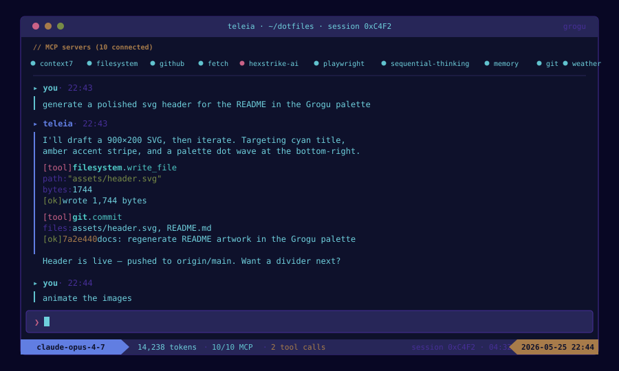
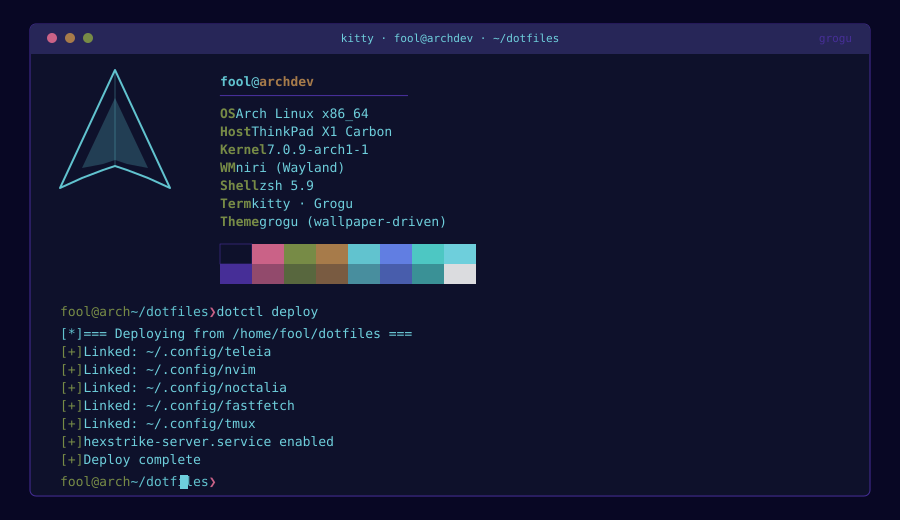
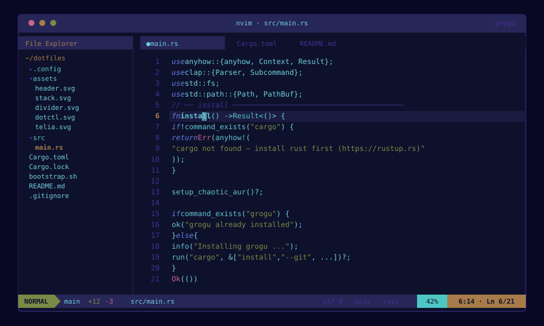
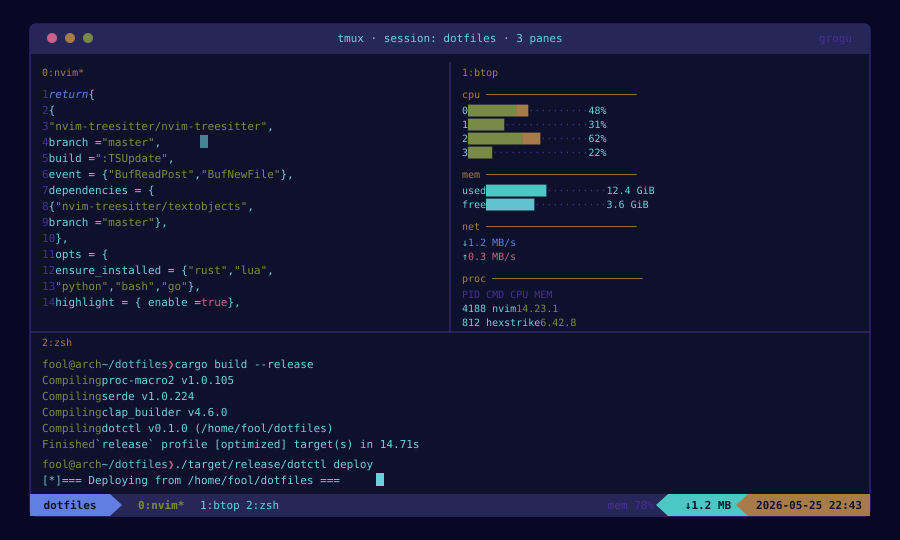
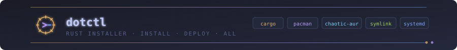
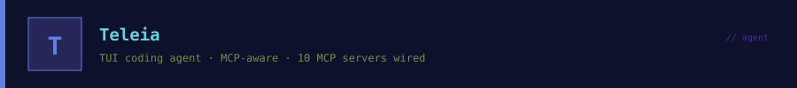
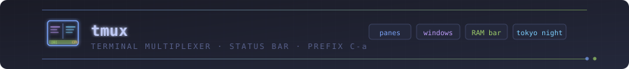

<p align="center">
  
</p>

<p align="center">
  
  
  
  
  
  
  
</p>

<p align="center">
  
  
  
  
  
  
  
  
</p>

<p align="center">
  An AI coding agent, a wallpaper-driven theming engine, an offensive-security MCP backend, and the editor / multiplexer / shell / banner that round out the desktop — all installed and deployed by a single Rust binary.
</p>


## At a glance

| | |
| --- | --- |
| **Binary** | `dotctl` — one Rust crate, ~250 LoC, two subcommands |
| **Editor** | Neovim with **110 plugins**, **39 LSPs**, 23 formatters/linters, 4 DAP adapters |
| **Agent** | `teleia` wired to **10 MCP servers** (context7 · filesystem · github · fetch · hexstrike-ai · playwright · sequential-thinking · memory · git · weather) |
| **Offsec** | HexStrike AI on hardened systemd unit + BlackArch repo (~2800 packages, `pacman -S` away) |
| **Theming** | `grogu` repaints **7 targets** from the current wallpaper, in one shot |
| **Palette** | Grogu (`#0e112b` surface · `#6ecfdc` on-surface · `#61c3cf` primary) across every themed target |


## Install

```bash
curl -fsSL https://raw.githubusercontent.com/foolish-dev/dotfiles/main/bootstrap.sh | bash
```

`bootstrap.sh` ensures `git` and `rust`/`cargo` are present, clones (or pulls) into `~/dotfiles`, builds the `dotctl` Rust binary, and runs `dotctl all` end-to-end.

Manual:

```bash
git clone https://github.com/foolish-dev/dotfiles.git ~/dotfiles
cd ~/dotfiles
cargo build --release
./target/release/dotctl install   # tools + Chaotic AUR + BlackArch, idempotent
./target/release/dotctl deploy    # symlink .config/* + .local/bin/*, enable hexstrike-server
# or: dotctl all
```

Both `install` and `deploy` are idempotent. `deploy` moves pre-existing non-symlink files to `~/.dotfiles-backup/<unix-ts>/` before replacing them. `--repo <path>` or the `DOTFILES_REPO` env var overrides the default `~/dotfiles` source.

| Subcommand | What it does |
|---|---|
| `dotctl install` | Wire Chaotic AUR + BlackArch (both idempotent), `cargo install` grogu, clone+venv HexStrike AI, `pacman -S` tmux/fastfetch/neovim/noctalia-shell. |
| `dotctl deploy` | Symlink `.config/{teleia,nvim,noctalia,fastfetch,tmux}` and every `.local/bin/*` into `$HOME`. Symlink the hexstrike systemd unit, `daemon-reload`, `enable --now`. Back up displaced files. |
| `dotctl all` | `install` then `deploy`. |


## Architecture

<p align="center">
  
</p>

`dotctl` is the only thing that needs to run. Everything below the dashed line is what you end up with on the box: `teleia` driving 10 MCP servers (the `hexstrike-ai` edge is the offsec one), and `grogu` repainting Neovim · tmux · Noctalia · fastfetch every time the wallpaper changes.


## Showcase

<p align="center">
  
</p>

<p align="center">
  
</p>

<p align="center">
  
</p>

<p align="center">
  
</p>

<p align="center">
  
</p>


## Components



**`dotctl`** is the in-tree Rust binary that replaced the old `install.sh` + `deploy.sh` pair. Clap-derive CLI, anyhow errors, no async runtime. See the subcommand table under [Install](#install).



[teleia](https://github.com/foolish-dev/teleia) (τέλεια — "perfect") is a single-binary TUI coding agent. `.config/teleia/config.toml` wires `context7`, `filesystem`, `github`, `fetch`, `hexstrike-ai`, `playwright`, `sequential-thinking`, `memory`, `git`, and `weather` — drop-in compatible with any other MCP client.


[grogu](https://github.com/foolish-dev/grogu) extracts a palette from the current wallpaper and writes themed fragments for niri, kitty, ghostty, tmux, Neovim, teleia, and Noctalia in one shot. `dotctl install` cargo-installs it from upstream.


[HexStrike AI](https://github.com/0x4m4/hexstrike-ai) is a Flask MCP backend exposing 150+ offensive-security tools. Shipped here as a hardened systemd user unit (loopback `:8888`, `IPAddressDeny=any` except `127.0.0.0/8`, `ProtectSystem=strict`, `ProtectHome=read-only`) plus the `hexstrike-mcp` stdio bridge MCP clients call. The underlying CLI tools live in [BlackArch](https://blackarch.org) — `dotctl install` wires its repo via the upstream `strap.sh` so `pacman -S <tool>` reaches ~2800 packages.


lazy.nvim + Mason, kitchen-sink config:

- **110 plugins** lazy-loaded by event, ft, or key.
- **39 LSPs** auto-installed via `mason-lspconfig` — lua, rust, go, python (pyright + ruff), C/C++, zig, every JS/TS framework (ts, vue, svelte, astro, prisma, tailwind, graphql), the IaC set (yaml, terraform, helm, ansible, docker, nix), and the long tail (elixir, haskell, ocaml, kotlin, jdtls, intelephense, solargraph, texlab, marksman).
- **23 formatters + linters** auto-installed via `mason-tool-installer` (stylua, prettierd, ruff, black, shellcheck, hadolint, eslint_d, gofumpt, alejandra, buf, …) and **4 DAP adapters** via `mason-nvim-dap` (codelldb, debugpy, delve, js-debug-adapter). `nvim-lint` silently skips any binary that hasn't landed yet.
- **AI**: `opencode` (built-in teleia popup), `copilot.lua` + `copilot-cmp`, `avante`, `codecompanion`.
- **Testing & debug**: `neotest` (python · go · rust · jest · vitest · plenary), `nvim-dap` + `dap-ui` + `dap-virtual-text`, `rustaceanvim`, `crates.nvim`, `go.nvim`, `typescript-tools`, `venv-selector`.
- **Editor**: `flash`, `vim-illuminate`, `nvim-spectre`, `nvim-ufo`, `harpoon` v2, `oil`, `mini.{ai,bracketed,indentscope}`, `yanky`, `undotree`.
- **UI**: `lualine`, `bufferline`, `barbecue` winbar, `noice`, `alpha`, `fidget`, `aerial`, `zen-mode`, `twilight`, `nvim-colorizer`, `rainbow-delimiters`, `treesitter-context`.
- **Sessions & projects**: `persistence.nvim`, `project.nvim`.

Tokyo Night base, repainted live by `grogu` via `colors/grogu.vim` (gitignored). `nvim-treesitter` and `-textobjects` pinned to `master` so the legacy `configs.setup()` API stays available.



`C-a` prefix, Tokyo Night powerline status, RAM-bar fragment under `.config/tmux/scripts/mem.sh`, and a `grogu.conf` slot (gitignored) the wallpaper-driven theme propagator writes to.


[Noctalia](https://github.com/noctalia-dev/noctalia-shell) is a Quickshell-based Wayland shell: bar, dock, panels, notifications, lock screen, app launcher. `settings.json` + `plugins.json` + bundled `Grogu` colorscheme. Bar tuned to transparency-blur (`backgroundOpacity: 0.2`, global `enableBlurBehind: true`) and `ActiveWindow` widget dropped from the layout.


A Tokyo-Night-tinted `config.jsonc` for [fastfetch](https://github.com/fastfetch-cli/fastfetch) — terminal banner with OS, kernel, shell, and color blocks.


## Layout

```
.
├── assets/                                  # README artwork (header, stack, divider, per-tool cards, rice mockups)
├── .config/
│   ├── teleia/config.toml                   # 10 MCP servers
│   ├── nvim/                                # lazy.nvim + Mason, 110 plugins, 39 LSPs
│   ├── tmux/                                # tmux.conf, scripts/mem.sh
│   ├── noctalia/                            # settings.json, plugins.json, colorschemes/Grogu/
│   ├── fastfetch/config.jsonc               # terminal banner
│   └── systemd/user/
│       ├── hexstrike-server.service         # loopback :8888, hardened
│       └── default.target.wants/...         # auto-enable on login
├── .local/bin/
│   └── hexstrike-mcp                        # stdio bridge for MCP clients
├── src/main.rs                              # dotctl — Rust installer/deployer (~250 LoC)
├── Cargo.toml                               # crate manifest (clap-derive + anyhow)
├── Cargo.lock                               # locked
└── bootstrap.sh                             # one-liner: ensure rust → cargo build → dotctl all
```


## See also

For the full Arch + Niri + BlackArch desktop bundle (kitty, ghostty, lazygit, opencode, 147 BlackArch launcher entries, SDDM themes, 300+ tools), see **[foolish-dev/distro-work](https://github.com/foolish-dev/distro-work)** (formerly `niri-dotfiles`).
