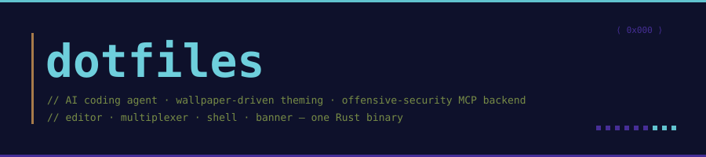
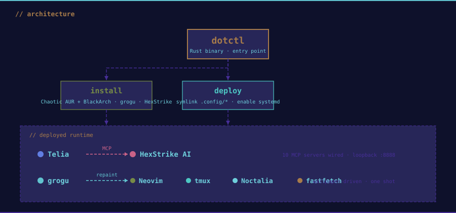
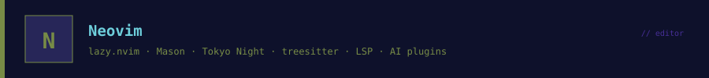
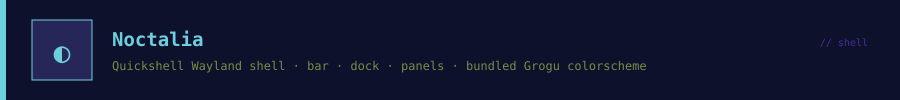
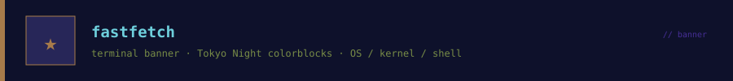

<p align="center">
  
</p>

<p align="center">
  
  
  
  
  
  
</p>

<p align="center">
  
  
  
  
  
  
</p>

<p align="center">
  Minimal portable config bundle: an AI coding agent, a wallpaper-driven theming engine, an offensive-security MCP backend, and the editor/shell/banner that round out the desktop. <code>curl | bash</code> on a fresh Arch box.
</p>


## Install

```bash
curl -fsSL https://raw.githubusercontent.com/foolish-dev/dotfiles/main/bootstrap.sh | bash
```

Manual:

```bash
git clone https://github.com/foolish-dev/dotfiles.git ~/dotfiles
cd ~/dotfiles
./install.sh    # tools: grogu (cargo), HexStrike AI (clone+venv), Neovim/Noctalia/fastfetch (pacman on Arch)
./deploy.sh     # symlinks .config/* and .local/bin/* into $HOME, enables hexstrike-server.service
```

Re-running `deploy.sh` is idempotent: pre-existing non-symlink files are moved to `~/.dotfiles-backup/<timestamp>/` before being replaced.


## Architecture

<p align="center">
  
</p>


## Components


[Telia](https://github.com/foolish-dev/telia) is a single-binary TUI coding agent. The bundled `.config/telia/config.toml` wires `context7`, `filesystem`, `github`, `fetch`, `hexstrike-ai`, `playwright`, `sequential-thinking`, `memory`, `git`, and `weather` — drop-in compatible with any other MCP client.


[grogu](https://github.com/foolish-dev/grogu) extracts a palette from the current wallpaper and writes themed fragments for niri, kitty, ghostty, tmux, Neovim, Telia, and Noctalia in one shot. `install.sh` cargo-installs it from upstream.


[HexStrike AI](https://github.com/0x4m4/hexstrike-ai) is a Flask MCP backend exposing 150+ offensive-security tools. Shipped here as a hardened systemd user unit (loopback `:8888`, `IPAddressDeny=any` except `127.0.0.0/8`, `ProtectSystem=strict`, `ProtectHome=read-only`) plus the `hexstrike-mcp` stdio bridge MCP clients call.



lazy.nvim + Mason setup. Tokyo Night base, treesitter, LSP, AI plugins (Copilot, Avante). First `nvim` launch auto-installs everything. Generated `colors/grogu.vim` (live-repainted by grogu) and `.luarc.json` stay gitignored.



[Noctalia](https://github.com/noctalia-dev/noctalia-shell) is a Quickshell-based Wayland shell: bar, dock, panels, notifications, lock screen, app launcher. `settings.json` + `plugins.json` + the bundled `Grogu` color scheme.



A Tokyo-Night-tinted `config.jsonc` for [fastfetch](https://github.com/fastfetch-cli/fastfetch) — terminal banner with OS, kernel, shell, and color blocks.


## Layout

```
.
├── assets/                                  # README artwork
├── .config/
│   ├── telia/config.toml                    # 10 MCP servers
│   ├── nvim/                                # lazy.nvim + Mason, Tokyo Night, LSP, AI
│   ├── noctalia/                            # settings.json, plugins.json, colorschemes/Grogu/
│   ├── fastfetch/config.jsonc               # terminal banner
│   └── systemd/user/
│       ├── hexstrike-server.service         # loopback :8888, hardened
│       └── default.target.wants/...         # auto-enable on login
├── .local/bin/
│   └── hexstrike-mcp                        # stdio bridge for MCP clients
├── bootstrap.sh                             # one-liner: clone + install.sh + deploy.sh
├── install.sh                               # tool installs (grogu, HexStrike, Neovim, Noctalia, fastfetch)
└── deploy.sh                                # symlink configs into $HOME, enable hexstrike service
```


## See also

For the full Arch + Niri + BlackArch desktop bundle (kitty, tmux, ghostty, lazygit, opencode, 147 BlackArch launcher entries, SDDM themes), see **[niri-dotfiles](https://github.com/foolish-dev/niri-dotfiles)**.
